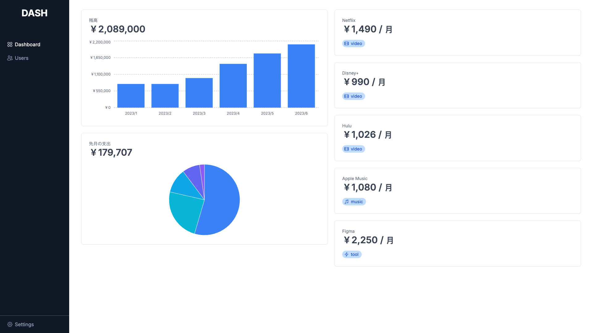

# Home Dashboard

Next.js / [tremor](https://www.tremor.so/)

## Getting Started

First, run the development server:

```bash
npm run dev
# or
yarn dev
# or
pnpm dev
```

## Screenshots

by [otaly/readme-screenshot-action](https://github.com/otaly/readme-screenshot-action)

<!-- [README-SCREENSHOT-BEGIN] -->

<!-- [README-SCREENSHOT-END] -->